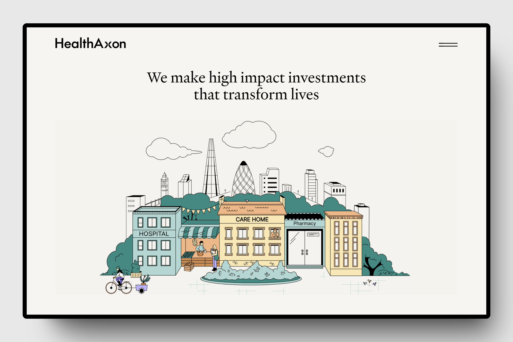

<h2 align="center">Página: Aún no disponible</h2>

<h2 >Tecnologías usadas👨🏻‍💻</h2>
 
<h4>Front end: </h4>

<h4>Servicios: </h4>

<h4>IDEs: </h4>

<h4>Apps:</h4>

<h1>healthaxon</h1>

Bienvenido a healthaxon frontend project, diseñado por Pablo Nieto (GitHub: <a href="https://github.com/pabloWIB">pabloWIB</a>)

<h2>Resumen</h2>

HealthAxon es una organización con sede en el Reino Unido que realiza inversiones en la felicidad. Cuantificamos tanto los retornos sociales como financieros generados por nuestras inversiones, con una cartera compuesta por servicios sostenibles de salud y cuidado social. Nuestros clientes incluyen autoridades locales, el NHS y particulares.   Pensamos de manera holística sobre los retornos y creemos en crear un impacto duradero y escalable basado en nuestros valores, alineando a las partes interesadas.

<h2>Características</h2>

<ul>
    <li><strong>Diseño Responsivo:</strong> La aplicación está diseñada para funcionar perfectamente en diferentes dispositivos y tamaños de pantalla, proporcionando una experiencia de usuario consistente.</li>
    <li><strong>Animaciones con jQuery:</strong> La aplicación utiliza jQuery para implementar animaciones suaves y dinámicas que mejoran la interacción del usuario y hacen la experiencia más atractiva.</li>
    <li><strong>Manejo de JavaScript para funciones:</strong> La aplicación emplea JavaScript para gestionar diversas funciones y características, asegurando una funcionalidad robusta y eficiente en todo momento.</li>
</ul>

<h2>Tecnologías Utilizadas</h2>

<ul>
    <li><strong>HTML5:</strong> Utilizado para estructurar el contenido de las páginas web.</li>
    <li><strong>CSS3 (Sass):</strong> Utilizado para estilar la interfaz de usuario y crear diseños responsivos.</li>
    <li><strong>JavaScript (Vanilla JS, jQuery):</strong> Utilizado para implementar características interactivas y mejorar la experiencia del usuario.</li>
</ul>

<h2>Empezando</h2>

Para comenzar con el proyecto frontend de Easybank, sigue estos pasos:

<ol>
    <li>Clona este repositorio en tu máquina local usando <code>git clone</code>.</li>
    <li>Abre el directorio del proyecto en tu editor de código.</li>
    <li>Explora los archivos del proyecto y revisa el código HTML, CSS y JavaScript.</li>
    <li>Realiza cambios o adiciones según sea necesario para personalizar el proyecto según tus preferencias o practicar habilidades frontend específicas.</li>
    <li>Prueba la aplicación localmente abriendo el archivo <code>index.html</code> en un navegador web.</li>
</ol>

<h2>Contribuciones</h2>

¡Las contribuciones al proyecto frontend de (Nombre proyecto) son bienvenidas! Si tienes ideas para mejoras, correcciones de errores o nuevas características, no dudes en abrir un problema o enviar una solicitud de extracción.

<h2>Licencia</h2>

Este proyecto está bajo la <a href="LICENSE">Licencia MIT</a>.

